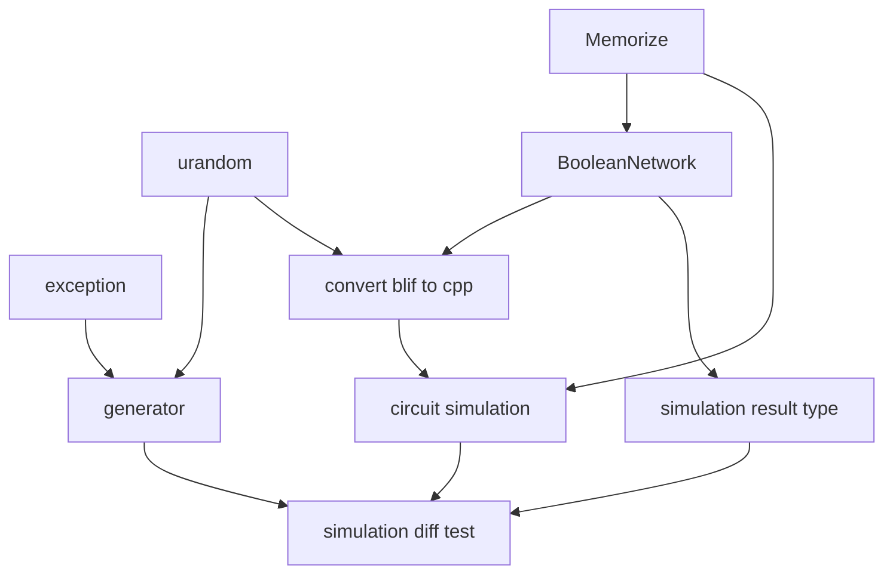
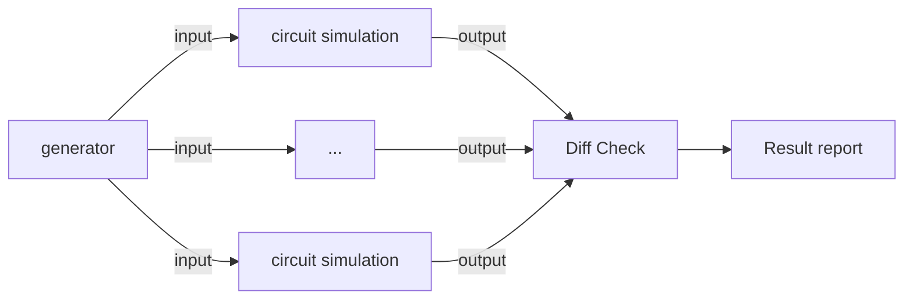

# Readme

> Simulator for `blif` circuit.

> Origin Author: [Yao Yue](https://github.com/tripack45)

> Maintainer: [Su Hang](https://github.com/tonyfloatersu) and [Zhou Zhuangzhuang](https://github.com/zzhou612)

> Code view tips: if you view it on github, please add ?ts=4

## How to use

- Supported platform: Linux
- Required compiler: g++ (cpp17)
- Make system: Cmake (using clion)
- Additional requirements: boost

### Some Basic Introduction to Install and Use

- First set the `install_bnet`, edit its configuration with executable `dummy_target`.
- Then change the build target into `simu_test`.

### Circuit Convention

- Each input/output/internal node start with no-digit symbol
- Allow Symbol only from [A-Za-z0-9_], no other symbol

## TBD

- [ ] simulation diff test enable.
- [ ] BooleanNetwork version match, current one is ahead of origin version.

## Project Structure

### Simulation Diff Test

